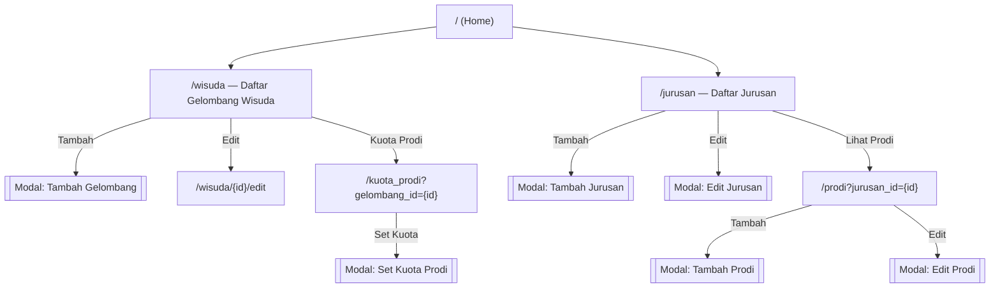
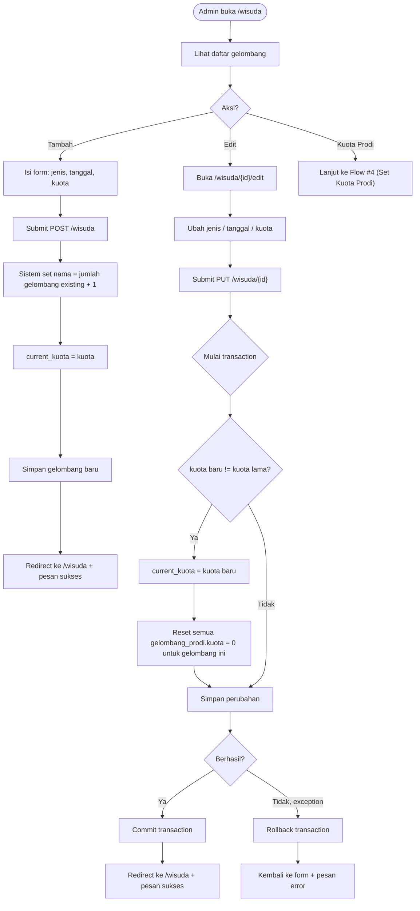
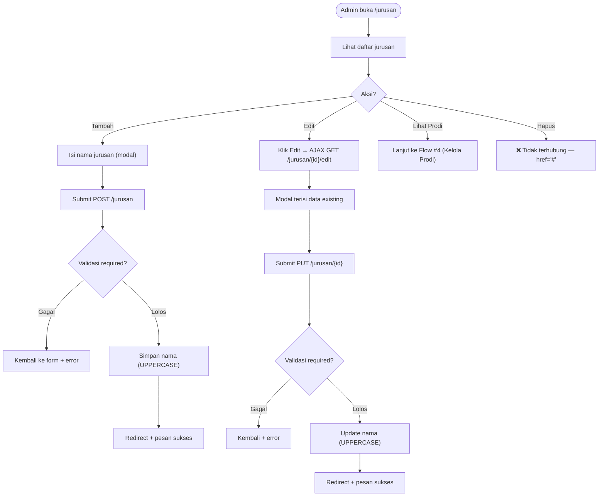
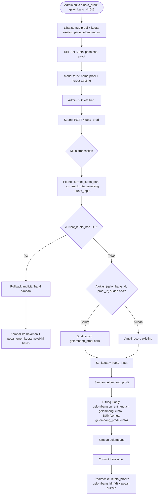
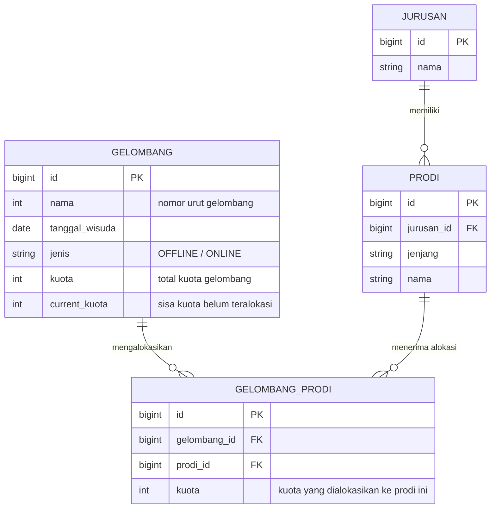

# Flow Map — Kuota Wisuda

Diagram dibuat dengan sintaks [Mermaid](https://mermaid.js.org/) yang
dirender otomatis oleh GitHub. Semua alur diringkas dari logika aktual di
controller (`app/Http/Controllers`), bukan asumsi.

---

## 1. Site Map / Navigasi Umum



> Catatan: tidak ada halaman login pada site map ini karena memang belum
> ada autentikasi aktif di aplikasi (lihat `docs/SRS.md` §2.2 dan §5.3).

---

## 2. Flow: Kelola Gelombang Wisuda (Tambah & Edit)



**Poin penting**: mengubah `kuota` gelombang adalah operasi destruktif
terhadap alokasi yang sudah ada — semua kuota prodi pada gelombang tsb
di-reset ke 0. Admin perlu menyadari ini sebelum mengubah kuota gelombang
yang sudah punya alokasi.

---

## 3. Flow: Kelola Jurusan



---

## 4. Flow: Kelola Program Studi (Prodi)

```mermaid
flowchart TD
    A(["Admin buka /prodi?jurusan_id={id}"]) --> B["Lihat daftar prodi milik jurusan tsb"]
    B --> C{Aksi?}

    C -->|Tambah| D["Pilih jenjang (D3/D4/S2) + isi nama (modal)"]
    D --> E["Submit POST /prodi"]
    E --> F{"Validasi nama & jenjang required?"}
    F -->|Gagal| G[Kembali ke form + error]
    F -->|Lolos| H["Simpan nama = UPPERCASE('{jenjang} {nama}')"]
    H --> I[Redirect ke /prodi?jurusan_id={id} + sukses]

    C -->|Edit| J["Klik Edit → AJAX GET /prodi/{id}/edit"]
    J --> K["Modal terisi: nama (tanpa prefix jenjang) + jenjang"]
    K --> L["Submit PUT /prodi/{id}"]
    L --> M{Validasi?}
    M -->|Gagal| N[Kembali + error]
    M -->|Lolos| O["Update nama = UPPERCASE('{jenjang} {nama}')"]
    O --> P[Redirect + sukses]

    C -->|Hapus| Q["❌ Tidak diimplementasikan"]
```

---

## 5. Flow: Set Kuota Prodi per Gelombang



**Aturan bisnis kunci** (`SRS-F-KTP-03`): total kuota yang dialokasikan ke
seluruh prodi pada satu gelombang tidak boleh melebihi `kuota` gelombang
tersebut. Validasi dilakukan terhadap **sisa kuota saat ini**
(`current_kuota`), bukan menjumlah ulang seluruh alokasi sebelum
validasi — sehingga urutan operasi (validasi dulu, baru simpan) penting
untuk menjaga konsistensi data.

---

## 6. Entity Relationship Diagram


