# Manual Pengguna — Kuota Wisuda

Manual ini menjelaskan cara menggunakan aplikasi **Kuota Wisuda** langkah demi
langkah, dilengkapi screenshot asli dari aplikasi yang sedang berjalan.
Seluruh screenshot di halaman ini **digenerate otomatis** memakai
[Playwright](https://playwright.dev) — lihat bagian
[Cara Meng-update Screenshot](#cara-meng-update-screenshot) bila UI berubah
di kemudian hari.

> **Catatan desain**: Aplikasi ini **sengaja tidak memiliki halaman
> login/autentikasi**. Ini adalah project pembelajaran sederhana, jadi
> seluruh halaman bisa langsung diakses tanpa proses masuk (login). Manual
> ini juga tidak membahas fitur "Hapus" karena memang belum tersedia di
> aplikasi (lihat [docs/FEATURES.md](./FEATURES.md)).

## Prasyarat

Jalankan aplikasi terlebih dahulu mengikuti panduan instalasi di
[README.md](../README.md) (root project) — `composer install`, `npm
install`, migrasi database, lalu `php artisan serve`.

## Daftar Isi

1. [Halaman Utama (Home)](#1-halaman-utama-home)
2. [Modul Wisuda (Gelombang)](#2-modul-wisuda-gelombang)
3. [Modul Kuota Prodi](#3-modul-kuota-prodi)
4. [Modul Jurusan](#4-modul-jurusan)
5. [Modul Program Studi (Prodi)](#5-modul-program-studi-prodi)
6. [Cara Meng-update Screenshot](#cara-meng-update-screenshot)

---

## 1. Halaman Utama (Home)

Setelah aplikasi dijalankan, buka `http://localhost:8000/`. Halaman ini
menampilkan sambutan singkat dan menu navigasi di sidebar kiri (**Home**,
**Wisuda**, **Jurusan**).

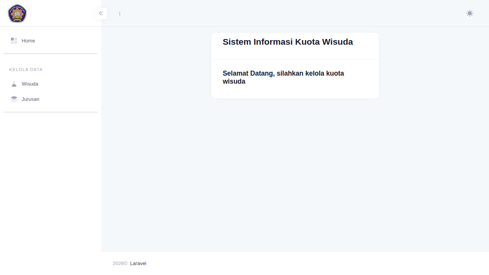

---

## 2. Modul Wisuda (Gelombang)

Modul ini untuk mengelola gelombang wisuda: kapan pelaksanaannya, jenisnya
(online/offline), dan total kuota peserta.

### 2.1 Melihat Daftar Gelombang Wisuda

Klik menu **Wisuda** di sidebar. Halaman menampilkan seluruh gelombang
wisuda yang sudah dibuat, lengkap dengan jenis, jadwal, kuota yang diset,
dan sisa kuota saat ini (**Kuota saat Ini**).

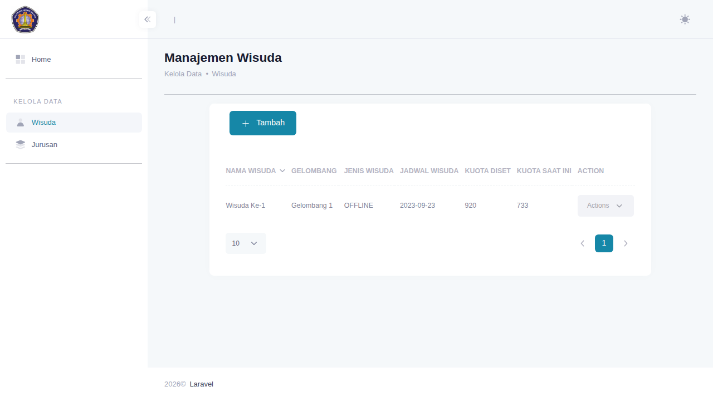

### 2.2 Menambah Gelombang Wisuda Baru

1. Klik tombol **+ Tambah**.
2. Isi **Jenis Wisuda** (ONLINE/OFFLINE), **Tanggal Wisuda**, dan **Set
   Kuota Wisuda**.
3. Klik **Save changes**.

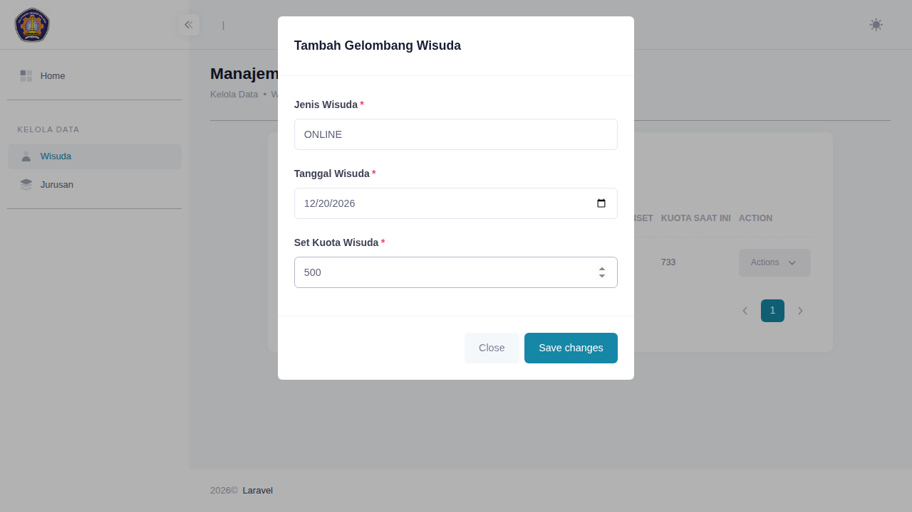

Nomor gelombang (mis. "Wisuda Ke-2") dibuat otomatis oleh sistem — tidak
perlu diisi manual. Setelah disimpan, gelombang baru langsung muncul di
daftar dengan sisa kuota (**Kuota saat Ini**) sama dengan kuota yang baru
saja diset (karena belum ada alokasi ke prodi manapun).

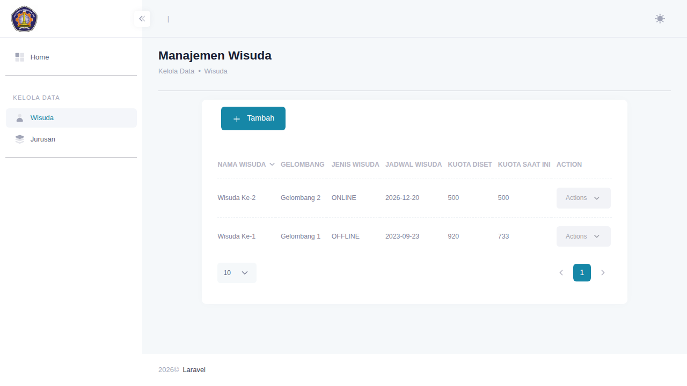

### 2.3 Mengedit Gelombang Wisuda

Klik dropdown **Actions** pada baris gelombang yang ingin diubah, lalu
pilih **Edit Data**. Form edit akan terisi otomatis dengan data yang ada.

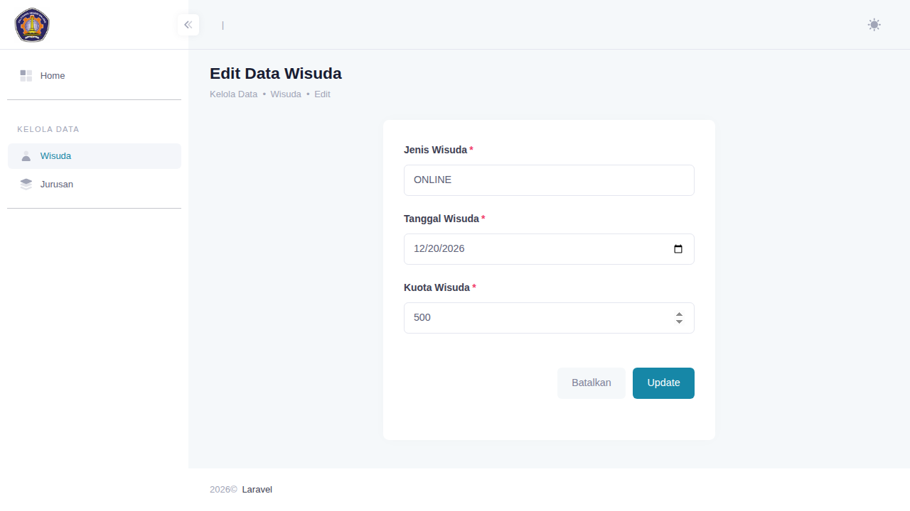

> ⚠️ **Perhatian**: Jika nilai **Kuota Wisuda** diubah di sini, sistem akan
> **mereset seluruh alokasi kuota prodi** pada gelombang tersebut kembali
> ke 0 (lihat modul [Kuota Prodi](#3-modul-kuota-prodi) di bawah). Ubah
> kuota hanya jika memang berniat mengalokasikan ulang dari awal.

---

## 3. Modul Kuota Prodi

Setelah gelombang wisuda dibuat, kuota totalnya perlu dibagi ke tiap
program studi. Dari dropdown **Actions** pada modul Wisuda, pilih
**Kuota Prodi** untuk masuk ke halaman ini.

### 3.1 Melihat Alokasi Kuota per Prodi

Halaman menampilkan seluruh program studi beserta kuota yang sudah
dialokasikan pada gelombang terkait, plus ringkasan **Kuota Gelombang**
(total) dan **Kuota Saat Ini** (sisa yang belum teralokasi).

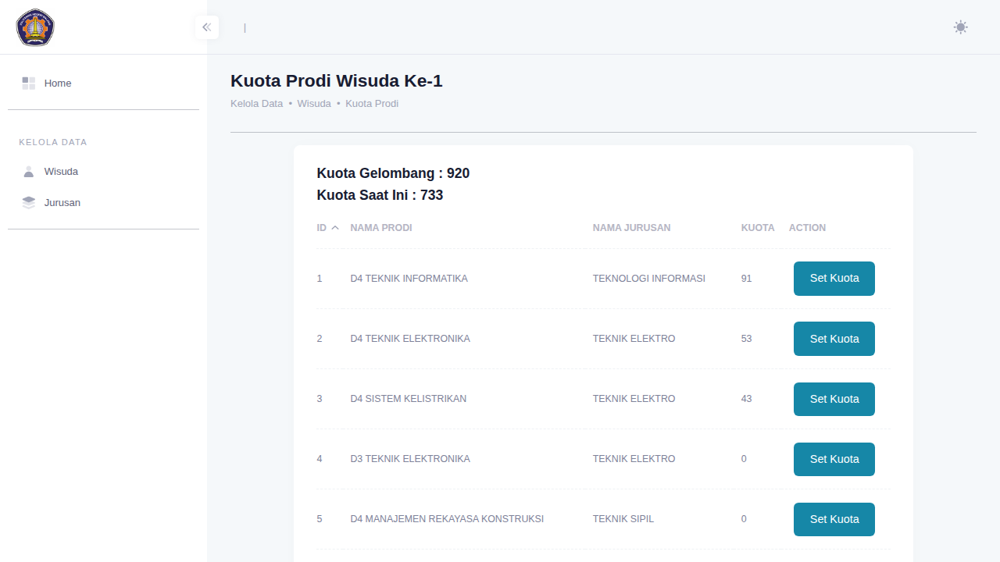

### 3.2 Mengatur Kuota Prodi

1. Klik tombol **Set Kuota** pada baris prodi yang dituju.
2. Modal akan terbuka dan **terisi otomatis** dengan kuota yang sedang
   berlaku untuk prodi tersebut.
3. Ubah angka **Kuota**, lalu klik **Save changes**.

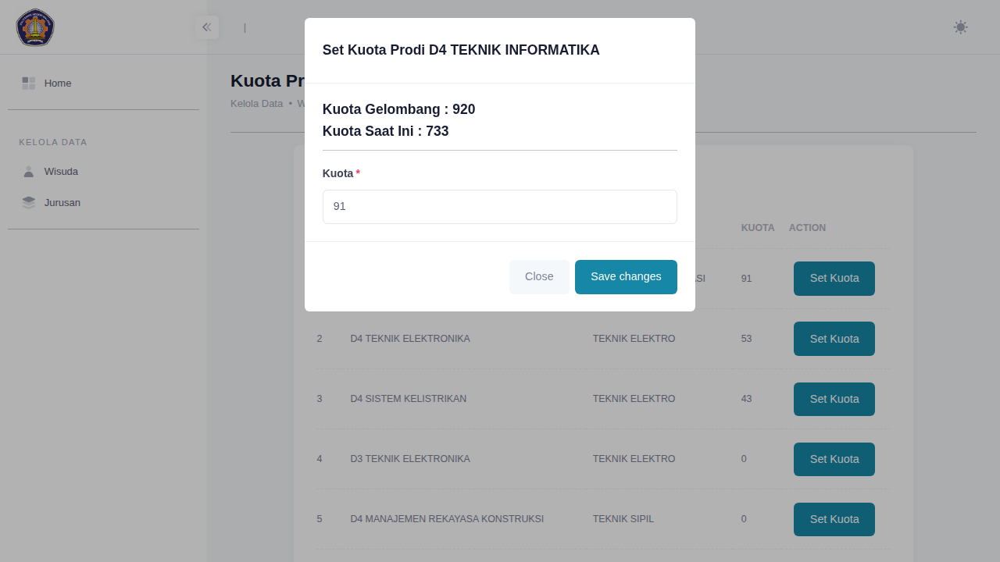

Sistem otomatis menolak input yang membuat total alokasi melebihi kuota
gelombang (nilai **Kuota Saat Ini** tidak boleh menjadi negatif). Setelah
tersimpan, kolom **Kuota Saat Ini** pada halaman Wisuda maupun Kuota Prodi
akan diperbarui otomatis.

---

## 4. Modul Jurusan

### 4.1 Melihat Daftar Jurusan

Klik menu **Jurusan** di sidebar untuk melihat seluruh jurusan yang
terdaftar.

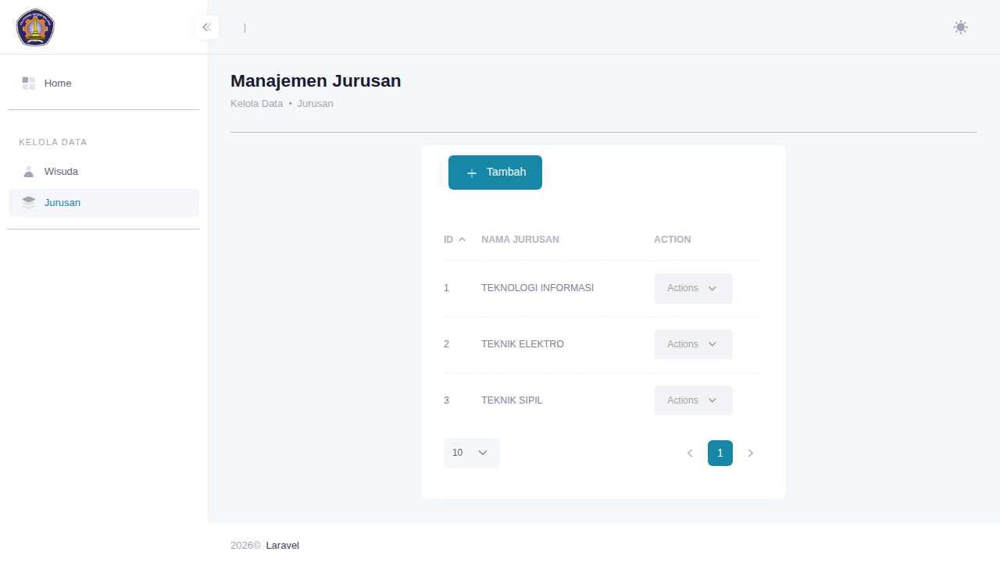

### 4.2 Menambah Jurusan

1. Klik tombol **+ Tambah**.
2. Isi **Nama Jurusan**.
3. Klik **Save changes**. Nama akan disimpan dalam huruf kapital secara
   otomatis.

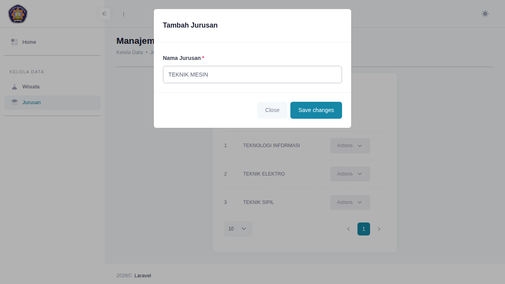

### 4.3 Mengedit Jurusan

Klik dropdown **Actions** pada baris jurusan, lalu pilih **Edit
Jurusan**. Data nama jurusan saat ini akan otomatis termuat di form.


### 4.4 Melihat Prodi di Suatu Jurusan

Dari dropdown **Actions**, pilih **Lihat Prodi** untuk masuk ke daftar
program studi milik jurusan tersebut (lihat modul berikutnya).

---

## 5. Modul Program Studi (Prodi)

Diakses melalui menu **Lihat Prodi** dari modul Jurusan, sehingga daftar
prodi yang tampil selalu terkait satu jurusan tertentu.

### 5.1 Melihat Daftar Prodi

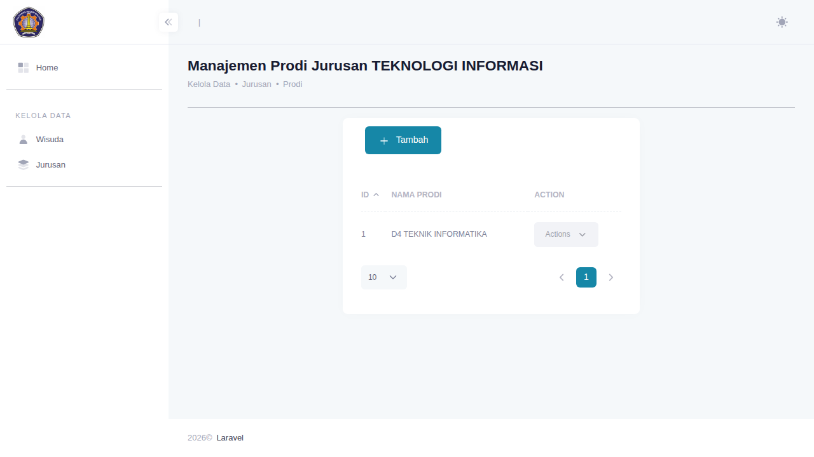

### 5.2 Menambah Prodi

1. Klik tombol **+ Tambah**.
2. Pilih **Jenjang** (D3/D4/S2) dan isi **Nama Prodi**.
3. Klik **Save changes**. Nama akhir yang tersimpan adalah gabungan
   jenjang dan nama, mis. "D3 TEKNIK PERANGKAT LUNAK".

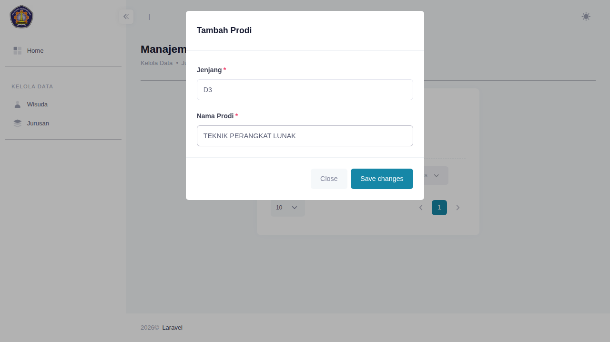

### 5.3 Mengedit Prodi

Klik dropdown **Actions** pada baris prodi, lalu pilih **Edit Prodi**.
Jenjang dan nama (tanpa prefix jenjang) akan otomatis termuat di form.

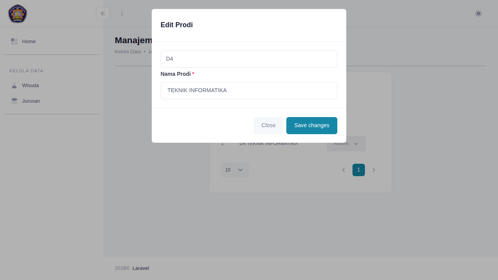

---

## Cara Meng-update Screenshot

Seluruh screenshot di manual ini dihasilkan otomatis oleh spec Playwright
`tests/e2e/screenshots.spec.js`, yang juga berfungsi sebagai smoke test
dasar untuk tiap modul. Untuk regenerasi (mis. setelah ada perubahan
tampilan):

```bash
# 1. Siapkan database dengan data contoh (gunakan DB terpisah, jangan produksi)
php artisan migrate:fresh --seed

# 2. Jalankan Playwright (otomatis menjalankan `php artisan serve` di background)
npm run test:e2e
```

File PNG akan ditulis ulang ke `docs/screenshots/`. Pastikan hasilnya
ditinjau ulang secara visual sebelum di-commit.
